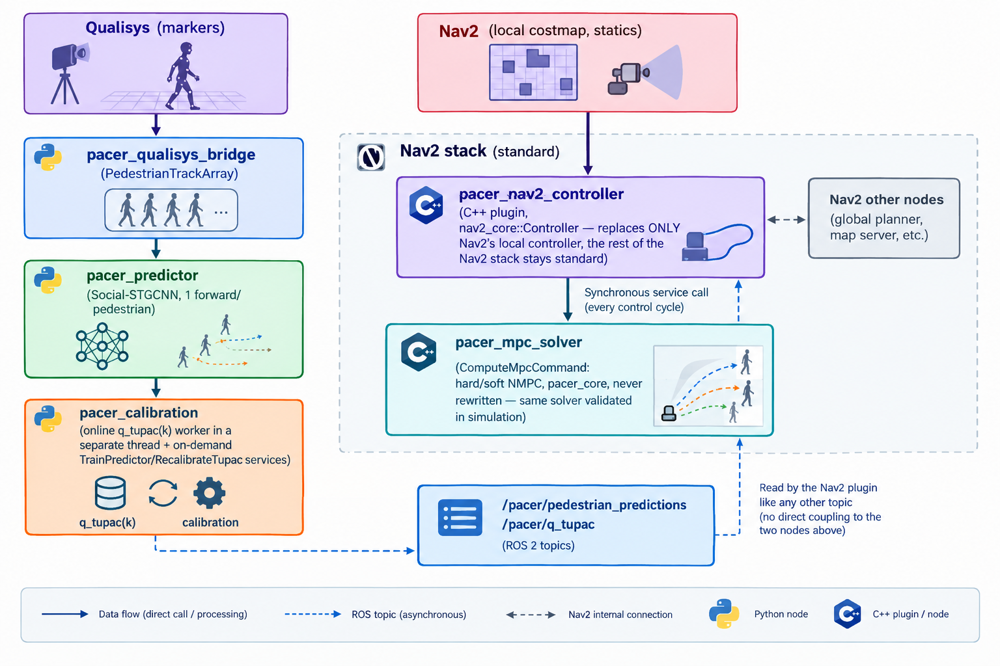

# pacer-tupac-code-ros

ROS2 (colcon workspace) port of the MPC-TUPAC controller validated in
simulation, with **direct** integration into Nav2 (`nav2_core::Controller`
plugin) and pedestrian ground truth from **Qualisys** (motion capture,
marker helmet — see vault note "Sim2Real - dettagli implementativi",
section "aggiornamento — ground truth pedoni per la campagna sperimentale
attuale").

Implements the architecture described in the vault note "Sim2Real -
dettagli implementativi": training and calibration **on demand** (never
implicit in the online node), an online node that reads the predicted
trajectory, computes `q_tupac(k)` online and applies the constrained NMPC
returning the control input, and Nav2 for static obstacles (via the local
costmap, as a soft cost) while the project's own module handles dynamic
pedestrians (hard constraint or soft cost, selectable — `controller_mode`).

## What was NOT done here (stated honestly, not by omission)

- **Not built/tested with `colcon build`**: this environment has no
  ROS2/colcon installed. All the **pure-Python** logic (`pacer_core`, and
  therefore also the three nodes `pacer_predictor`/`pacer_calibration`/
  `pacer_mpc_solver` that call into it) was however **actually run and
  verified** outside ROS2 in this environment (import, training on a mini
  dataset, D_cal construction, prediction, hard and soft NMPC with a
  pedestrian obstacle and a static obstacle together — see "What was
  verified here" at the bottom). The C++ Nav2 plugin
  (`pacer_nav2_controller`) is written against the standard
  `nav2_core::Controller` interface but **not compiled** here — it needs
  `colcon build` on a machine with ROS2 (Humble/Iron/Jazzy) + Nav2
  installed before use.
- **Assumed Qualisys message**: `pacer_qualisys_bridge` assumes the
  Qualisys driver publishes `mocap_msgs/msg/RigidBodies` (the convention
  used by the mocap4ros2/qualisys_ros2 ecosystem). If the installed driver
  uses a different package/message, only `_on_rigid_bodies()` in that file
  needs adapting — the rest of the node (buffering, resampling at dt_out,
  publishing) stays unchanged.
- **Calibration still simulated**: `pacer_core/calibration_offline.py`
  builds D_cal from SFM simulation (same engine as the development
  pipeline), not from real Qualisys logs — consistent with the current
  state declared in the Sim2Real note (no real data used to recalibrate
  yet). `build_dcal_from_qualisys_log()` is the extension point already
  laid down for when that becomes necessary.
- **Uniform static-obstacle weight**: `w_static` is a single parameter of
  the `pacer_mpc_solver` node, not per-obstacle — enough for a first
  working version, but a "hard" obstacle (a wall) and a "soft" one (a
  waste bin) today weigh the same in the cost.
- **No testing on real hardware, no latency characterization on the target
  embedded computer** — see the 3-phase rollout plan in the Sim2Real note
  (shadow mode -> soft at low speed -> hard constraint) before any real
  use.

## Architecture



The four Python nodes (`pacer_qualisys_bridge`, `pacer_predictor`,
`pacer_calibration`, `pacer_mpc_solver`) are launched together by
`pacer_bringup/launch/pacer_bringup.launch.py`. The Nav2 plugin registers
into the existing `controller_server` — see
`pacer_bringup/config/nav2_params_snippet.yaml` for how to point it there
(ONLY the local controller changes; planner/costmap/recovery stay the
standard Nav2 stack).

## Packages

| Package                 | Type                                 | Content                                                                                                                                                                                                                                                   |
| ----------------------- | ------------------------------------ | --------------------------------------------------------------------------------------------------------------------------------------------------------------------------------------------------------------------------------------------------------- |
| `pacer_msgs`            | ament_cmake (rosidl)                 | Shared messages/services (`PedestrianTrack[Array]`, `PedestrianPrediction[Array]`, `QTupacSnapshot`, `StaticObstacle`, `TrainPredictor.srv`, `RecalibrateTupac.srv`, `ComputeMpcCommand.srv`).                                                            |
| `pacer_core`            | ament_python (pure library, no ROS2) | Unicycle NMPC hard/soft, constant-area pedestrian Gaussians, TUPAC calibration (online + offline), Social-STGCNN predictor, SFM engine for D_cal, static-obstacle cost — **the same code validated in simulation**, reorganized as an importable package. |
| `pacer_qualisys_bridge` | ament_python                         | Qualisys (`mocap_msgs/RigidBodies`) -> `PedestrianTrackArray`, sampled at dt_out=0.4s.                                                                                                                                                                    |
| `pacer_predictor`       | ament_python                         | `PedestrianTrackArray` -> `PedestrianPredictionArray` (Social-STGCNN inference).                                                                                                                                                                          |
| `pacer_calibration`     | ament_python                         | Online update of `q_tupac(k)` (separate thread) + on-demand `TrainPredictor`/`RecalibrateTupac` services.                                                                                                                                                 |
| `pacer_mpc_solver`      | ament_python                         | `ComputeMpcCommand` service: one NMPC cycle, hard or soft, calling `pacer_core` directly.                                                                                                                                                                 |
| `pacer_nav2_controller` | ament_cmake (C++)                    | `nav2_core::Controller` plugin — bridge between Nav2 and `pacer_mpc_solver`, static obstacles from the local costmap.                                                                                                                                     |
| `pacer_bringup`         | ament_cmake                          | Launch file + parameters + `nav2_params.yaml` snippet.                                                                                                                                                                                                    |

## Build (on a machine with ROS2 + Nav2 installed, not verified here)

```bash
cd pacer-tupac-code-ros
colcon build --symlink-install
source install/setup.bash
```

## Usage

1. **On-demand training** of the predictor (service, never automatic):
   `ros2 service call /pacer/train_predictor pacer_msgs/srv/TrainPredictor "{scenario: open_field, n_runs_train: 6000, n_peds_scene: 10, epochs: 10, lr: 0.005, hidden_dim: 32, seed: 42, out_model_path: '/path/predictor.pt'}"`
2. **On-demand calibration** (D_cal + `q_tupac(k)` warm-start):
   `ros2 service call /pacer/recalibrate_tupac pacer_msgs/srv/RecalibrateTupac "{model_path: '/path/predictor.pt', scenario: open_field, n_runs_cal: 1500, n_peds_scene: 10, seed: 777, alpha: 0.1, delta: 0.1, h_param: 12, out_calibration_path: '/path/calibration'}"`
3. **Start the TUPAC module**: `ros2 launch pacer_bringup pacer_bringup.launch.py params_file:=<pacer_params.yaml with model_path/calibration_path filled in>`
4. **Start Nav2** with a `nav2_params.yaml` that includes the snippet in `pacer_bringup/config/nav2_params_snippet.yaml` (controller_server -> `PacerController`).

Recommended rollout on real hardware: shadow mode -> soft at low speed ->
hard constraint, exactly as in vault note Sim2Real §4 — not automated
here, it is an operating procedure for whoever uses this code.

## What was verified here (without ROS2 installed)

The entire `pacer_core` part (pure Python, no ROS2 dependency) was
actually run in this environment, not just written:

- package import and hard/soft NMPC wiring with a pedestrian obstacle
  AND a static obstacle together (new functionality of this port) — both
  solvers converge, the reported status is as expected.
- `predictor_utils.predict_window` on a window built by
  `window_builder.build_window` (the same function used by the
  `pacer_predictor` node) — correct output shapes (12,2)/(12,2,2).
- `OnlineCalibrationWorker` (thread, submit/snapshot/stop) — the same
  class used by the `pacer_calibration` node, unchanged behavior.
- the full offline calibration pipeline: SFM simulation -> windows ->
  prediction -> pool -> TUPAC quantile -> `.npz` save/load — the same one
  called by the `RecalibrateTupac` service.
- predictor training on a mini dataset (a few runs, 1 epoch) — the same
  function called by the `TrainPredictor` service.

Not verified (requires a full ROS2/Nav2 environment): compiling the C++
plugin, actual inter-node communication over topics/services, the
plugin's behavior inside Nav2's `controller_server`, integration with a
real Qualisys driver.

## Links

- Vault note "MPC Uniciclo sui Pedoni - Vincolo Rigido vs Costo Soft
  (confronto)" — the two controllers (`pacer_core.unicycle_nmpc`/
  `unicycle_nmpc_soft`) validated in simulation, reused here unchanged.
- Vault note "Sim2Real - dettagli implementativi" — problem, architecture
  and criticalities of this port (this code is its implementation).
